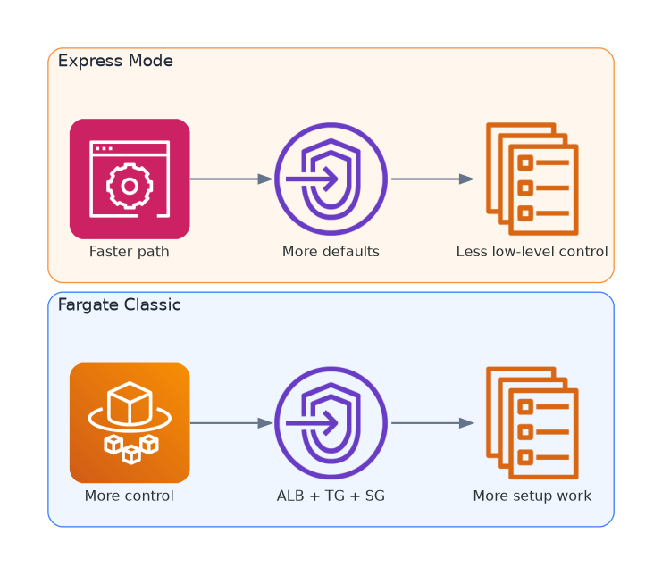

## Mục đích

Trang này so sánh hai hướng triển khai AWS backup runtime cho SnakeAid:

* **ECS Fargate Classic**
* **ECS Express Mode**

Mục tiêu không phải là kết luận một lựa chọn luôn tốt hơn lựa chọn còn lại. Mục tiêu là làm rõ trade-off giữa **mức độ kiểm soát** và **tốc độ triển khai**.

---

## Hai mô hình triển khai

### ECS Fargate Classic

Đây là hướng ECS tiêu chuẩn, nơi bạn tự cấu hình phần lớn các thành phần hạ tầng chính:

* ECS Cluster
* Task Definition
* ECS Service
* Application Load Balancer
* Target Group
* Security Groups
* Health checks
* Scaling rules

Nó nhiều bước hơn, nhưng đổi lại bạn giữ được quyền kiểm soát đầy đủ.

### ECS Express Mode

Đây là hướng triển khai đơn giản hóa, che bớt nhiều phần setup hạ tầng phía dưới bằng một workflow mức cao hơn.

Mục tiêu của nó là giảm số lượng quyết định kỹ thuật mà người triển khai phải chạm vào.

---

## Fargate Classic thường đòi hỏi gì

Với một web application thông thường, Fargate Classic thường kéo theo việc tự setup:

* target group
* listener của load balancer
* quan hệ giữa các security group
* chi tiết task definition
* networking cho service
* health check và scaling behavior

Điều này làm đường triển khai dài hơn, nhưng cũng giúp nhìn rõ hơn traffic đi như thế nào và runtime thật sự hoạt động ra sao.

---

## Express Mode đang cố đơn giản hóa điều gì

Express Mode giảm bớt phần việc vận hành ban đầu bằng cách tự động provision hoặc trừu tượng hóa các phần như:

* wiring của ECS service
* tích hợp load balancer
* target groups và health checks
* security defaults
* logs và deployment defaults

Trade-off của nó khá rõ: giảm effort setup thường đi kèm với việc giảm khả năng tùy biến chi tiết.

---

## Bảng so sánh

Bảng dưới đây là phiên bản thực dụng hơn của cùng trade-off đó.

| Khía cạnh | ECS Fargate Classic | ECS Express Mode |
| --------- | ------------------- | ---------------- |
| Độ phức tạp setup | Cao hơn | Thấp hơn |
| Thời gian có bản deploy đầu tiên | Chậm hơn | Nhanh hơn |
| Đường cong học tập | Dốc hơn | Nhẹ hơn |
| Kiểm soát ALB và target group | Đầy đủ | Trừu tượng hơn |
| Tinh chỉnh security group | Linh hoạt | Bị ràng buộc hơn |
| Kiến trúc đa service | Phù hợp hơn | Tùy phạm vi tính năng |
| Troubleshooting sâu | Dễ suy luận hơn | Khó hơn khi internals bị che |
| Mô hình network tùy biến | Phù hợp hơn | Có thể bị giới hạn |
| Use case nổi bật | Control cho production | Ra kết quả nhanh cho service đơn giản |

---

## Lợi ích của Fargate Classic

Fargate Classic thường phù hợp hơn khi bạn cần:

* thiết kế ALB và target group một cách tường minh
* nhiều service với trách nhiệm tách bạch
* kiểm soát network và security group chi tiết
* troubleshooting có thể lần theo resource thật
* điều chỉnh cold standby hoặc warm standby một cách chủ động

---

## Lợi ích của Express Mode

Express Mode hấp dẫn khi bạn cần:

* đi từ container image tới endpoint chạy được nhanh hơn nhiều
* giảm số lượng concept AWS mà team phải học
* giảm friction cho experiment hoặc internal tool
* dùng sensible defaults thay vì tự cấu hình mọi thứ

Với những team ưu tiên tốc độ, đây là lợi ích thực sự.

---

## Các giới hạn cần nhớ của Express Mode

Express Mode sẽ yếu thế hơn nếu service cần:

* networking có ràng buộc đặc thù
* traffic pattern không mặc định
* debug ở mức resource chi tiết
* phối hợp nhiều service phức tạp
* security rules chuyên biệt

Điều đó không có nghĩa là nó tệ. Chỉ là mức abstraction của nó có thể trở thành giới hạn.

---

## SnakeAid hiện tại hợp với hướng nào hơn

SnakeAid là một **disaster-aware hybrid architecture** với:

* self-hosted primary runtime
* AWS backup runtime
* traffic entry đi qua ALB
* tư duy failover
* messaging tách giữa RabbitMQ local và Amazon MQ

Vì vậy, **ECS Fargate Classic hiện là lựa chọn an toàn hơn cho backup path chính**. Nó giúp kiểm soát rõ hơn:

* ALB routing
* target group health checks
* quan hệ giữa các security group
* troubleshooting theo từng service
* thiết kế standby strategy

Tuy vậy, **Express Mode vẫn đáng để khai thác** cho:

* proof of concept triển khai nhanh
* workload backup đơn giản hơn
* các bài blog so sánh và thí nghiệm song song trong tương lai

---

## Thứ tự đọc đề xuất

1. Đọc trang so sánh này trước.
2. Xem **ECS Fargate ClickOps** để đi theo workflow thủ công đầy đủ.
3. Bổ sung **ECS Express ClickOps** khi cần đánh giá hướng triển khai nhanh.
