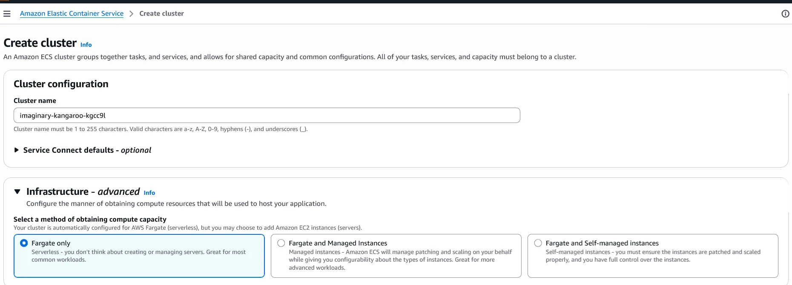
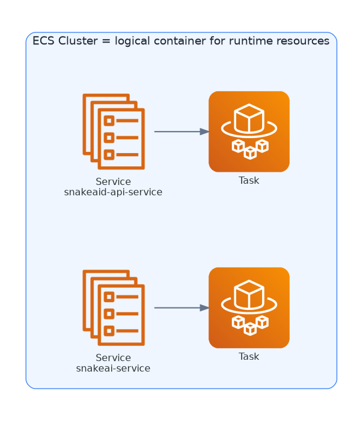
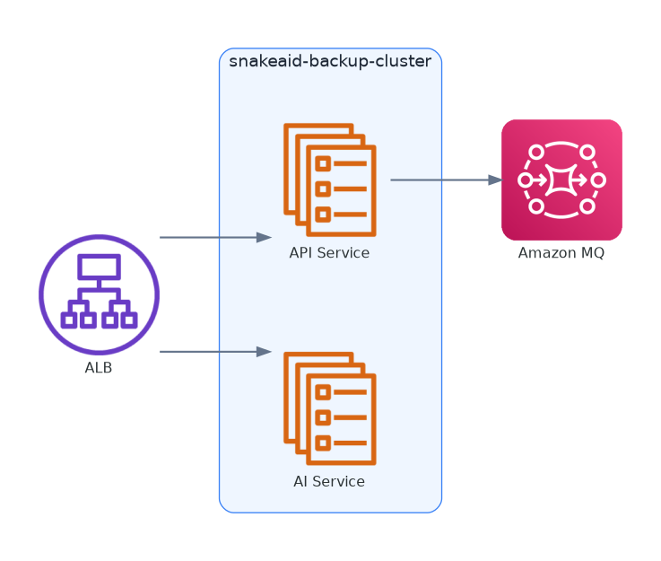
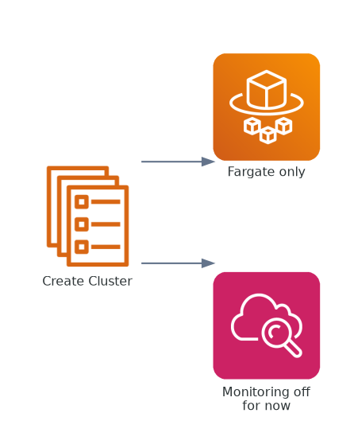
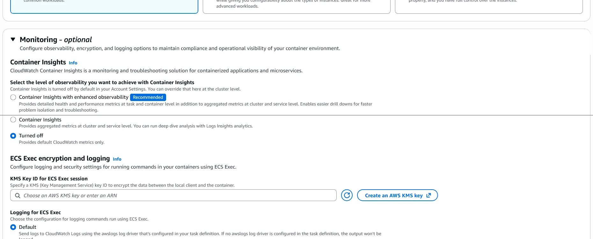
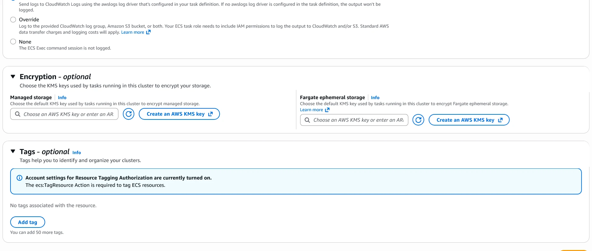
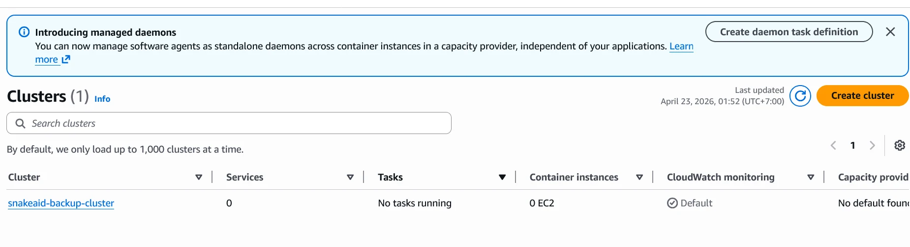

## Console Screen

Navigation: `Amazon Elastic Container Service > Create cluster`



---

## What Is an ECS Cluster?

In Amazon Elastic Container Service:

> **Cluster = a logical space to run containers**

* It is not a server
* It does not cost money directly
* It is mainly where services are grouped

The easiest mental model is: a cluster is the runtime boundary that holds services and tasks, not the compute itself.

### Cluster Scope Diagram



---

## Goal of This Step

Create a cluster to:

* run the backup system (API + AI)
* avoid server management
* make ALB attachment easier later

### Cluster In Context



---

## 1. Cluster Name

### Why naming matters

Later, you may have:

* dev cluster
* staging cluster
* backup cluster

So use a clear, meaningful name from the start.

### Recommended value

```text
snakeaid-backup-cluster
```

---

## 2. Infrastructure (most important part)

### What are you choosing?

You are choosing **how AWS runs containers for you**.

| Option  | Meaning                                   |
| ------- | ----------------------------------------- |
| Fargate | AWS runs containers, no server management |
| EC2     | you manage servers                        |
| Hybrid  | mix of both                               |

### Your goal

* no server management
* only backup instances needed
* no deep performance tuning yet

### Choose

```text
Fargate only
```

### Easy explanation

Fargate is the mode where you define the container settings, and AWS takes care of the underlying machines.

You only define:

* image
* RAM / CPU



---

## 3. Monitoring

### What is Container Insights?

Monitoring for:

* CPU, RAM
* network
* log analytics

### For your case

* this is a backup system
* no complex observability required now
* prioritize simplicity and cost

### Choose

```text
Turned off
```

### When to enable later

* performance debugging
* larger production scale

For now: not needed.



---

## 4. ECS Exec and Logging

### What is this?

* ECS Exec = remote shell into container
* Logging = command logs

### For your case

* no deep debugging needed now
* no remote exec need yet

### Action

```text
Keep default
```

---

## 5. Encryption

### What is this?

* storage encryption with KMS
* often needed for stricter compliance workloads

### For your case

* this layer is not handling highly sensitive data
* current focus is infrastructure setup

### Action

```text
Skip
```

---

## 6. Tags

### Why tags exist

Resource grouping by:

* project
* team
* cost tracking

### For your case

* detailed tracking is not required yet

### Action

```text
Skip
```



---

## Final Configuration

Click **Create**.

## Expected Result

After the cluster is created, the ECS clusters list should show `snakeaid-backup-cluster`.



---

## What You Get After This Step

You will have one empty ECS cluster ready to receive services later. No workload is running yet.

---

## Next Step (more important)
From here, the meaningful resources come next: task definitions, the load balancer path, and then ECS services.

---

## Key Insight

Many beginners think:

> "Cluster is the most important thing"

Not exactly. In practice:
The cluster is mainly the holder. The real runtime behavior comes from Task Definition, Service, and ALB working together.

---

## TL;DR

Set the name, choose Fargate, keep monitoring off for now, and create the cluster.
