## Goal of This Step

Create two separate task definitions for SnakeAid:

1. `snakeaid-api`
2. `snakeai`

---

## What Is a Task Definition?

In Amazon Elastic Container Service:

> **Task Definition = the container blueprint**

Equivalent mental model:

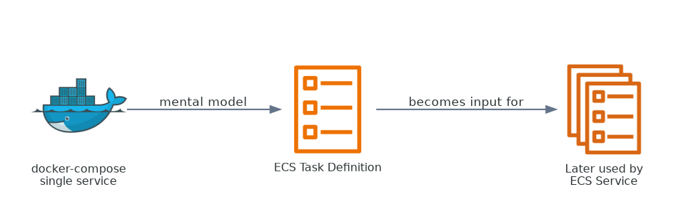

It defines:

* image
* port
* env
* CPU / RAM

The easiest way to read a task definition is: one part describes the container itself, and another part describes how ECS should run it.

### Task Definition Anatomy


That blueprint only becomes useful when ECS turns it into running tasks inside a service.

### Task Definition to Runtime Mapping

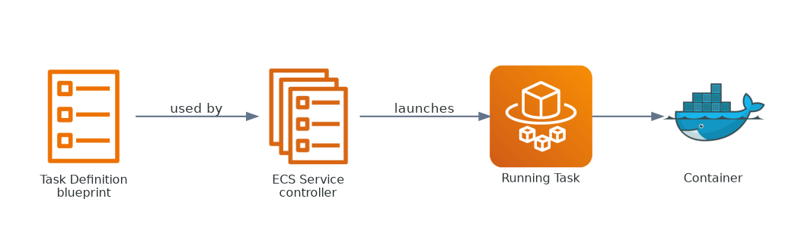

For SnakeAid, the API task and the AI task are similar in structure but different in runtime profile.

### API vs AI Task Profiles


IAM is the final piece many people miss on the first try. The task needs roles not because of application logic, but because ECS itself needs permission to pull images, send logs, and run correctly.

### IAM Roles in Task Execution

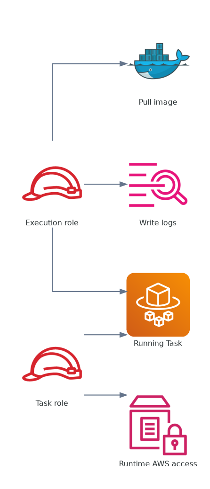

---

## Prerequisite Check

Before creating task definitions, confirm the backup cluster from Step 1 was created successfully.


---

## A. Navigate to Task Definitions

Navigation: `Amazon Elastic Container Service > Task definitions`

1. In the top search bar, type:

```text
Task definitions
```

2. Click:

```text
Task definitions
```

3. On the task list screen, click:

```text
Create new task definition
```

Either button works (middle or top-right).

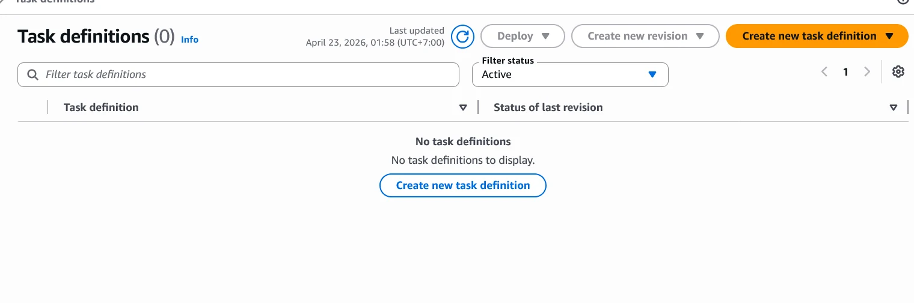

---

## B. Step 2A - Create Task Definition for API

You are now at the core ECS screen. It is long, so focus only on the required fields to avoid overload.

### Current objective

```text
Task Definition for snakeaid-api
```

You only need about 20% of the fields to make it run.

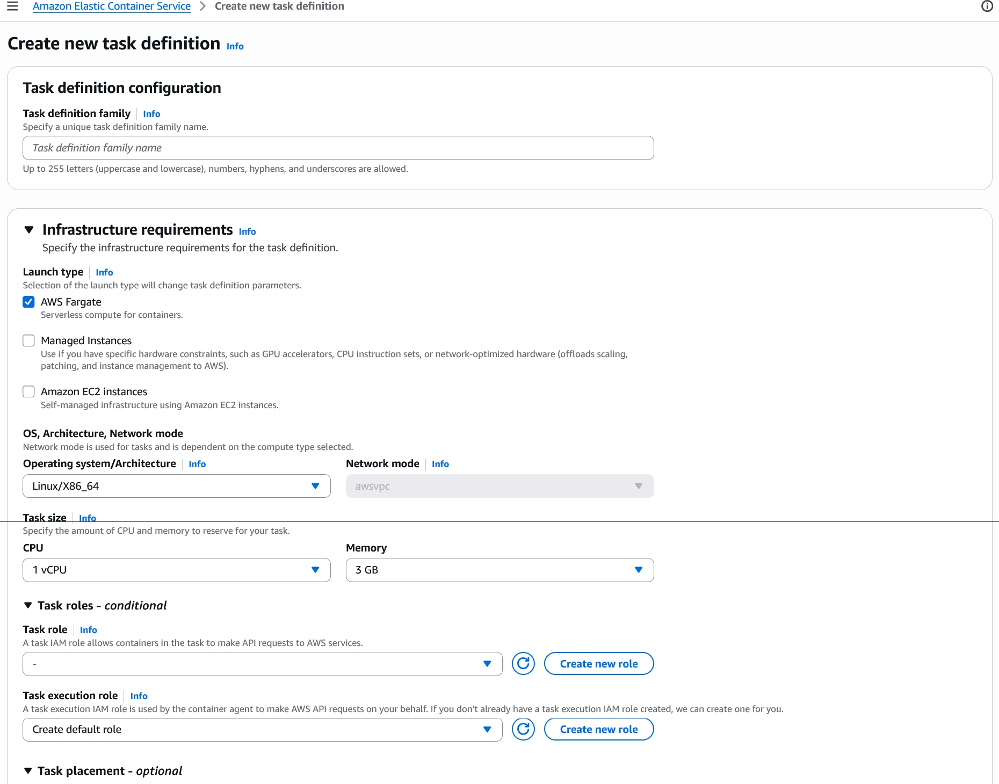

### 1. Task definition configuration

Meaning: general information for the container blueprint.

```text
Task definition family: snakeaid-api
```

### 2. Infrastructure requirements

Meaning: choose how containers will run (serverless vs managed servers).

```text
Launch type: AWS Fargate
```

### 3. Task size (important)

Meaning: CPU and RAM allocated to the container.

```text
CPU: 0.5 vCPU
Memory: 1 GB
```

This is sufficient for the current backend workload.

### 4. Container (most important section)

This section is equivalent to `docker run config`.

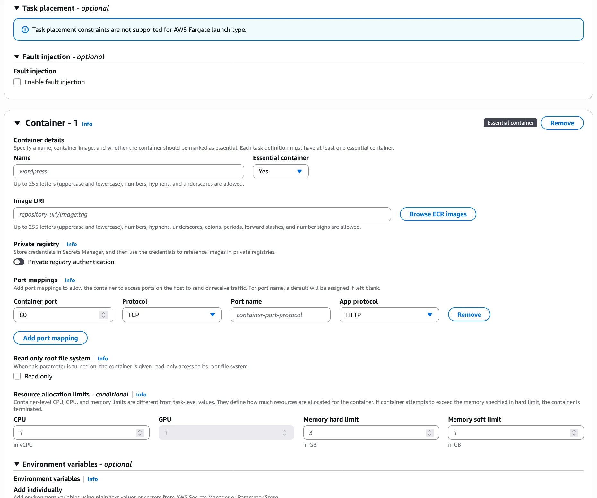

```text
Name: snakeaid-api
Image URI: thekhiem7/snakeaid-api:latest
```

Using Docker Hub here is fine for this stage.

### 5. Port mappings

ECS must know which port your app listens on.

```text
Container port: 8080
Protocol: TCP
```

### 6. Environment variables (very important)

This replaces env configuration from docker-compose.

```text
DOPPLER_TOKEN=your_token
DOPPLER_CONFIG=snake-aid/dev
RabbitMq__Host=<Amazon MQ endpoint>
```

Critical note:

```text
Do NOT use: rabbitmq
```

ECS does not include your local RabbitMQ container from self-host mode.

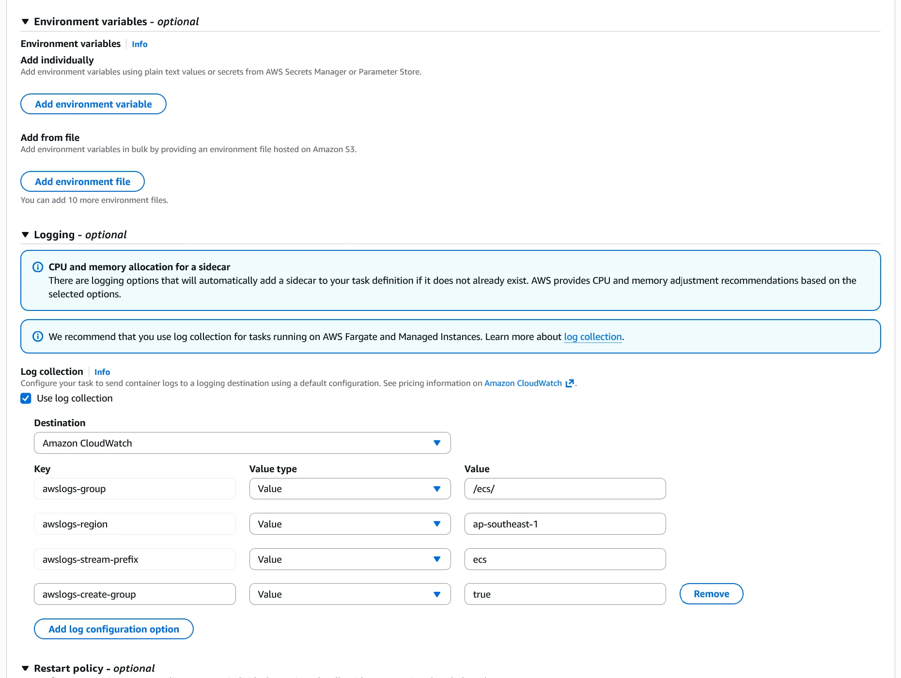

### 7. Logging

Logs will be sent to CloudWatch.

```text
Log driver: awslogs
Region: ap-southeast-1
Log group: auto create
```

### 8. Task role and Execution role

These are required IAM roles for the task.

```text
Create new role
```

For both roles:

* Task role
* Execution role

This is where the IAM role diagram above becomes practical: one role is about what the app can access, and the other is about what ECS needs in order to launch and operate the task.

### 9. Fields to skip

No need to touch these at this step:

* GPU
* Storage
* Firelens
* Volumes
* Health check (set later)
* Container dependency

### 10. Create task

```text
Create
```

Expected result:

```text
Task Definition: snakeaid-api (rev 1)
```

---

## C. Step 2B - Repeat for snakeai

Use the same flow for the AI service with this quick config:

```text
Name: snakeai
Image: thekhiem7/snakeaid-snake-detection-ai:8
Port: 8000
CPU: 1 vCPU
Memory: 2 GB
```

Compared with `snakeaid-api`, the AI task mainly changes sizing and container port. The overall ECS flow stays the same.

---

## D. Confirm Results

After completion, the task list should include:

* `snakeaid-api` (rev 1)
* `snakeai`

First confirm that the API task definition exists with the expected revision and base configuration.

### Screenshot: snakeaid-api

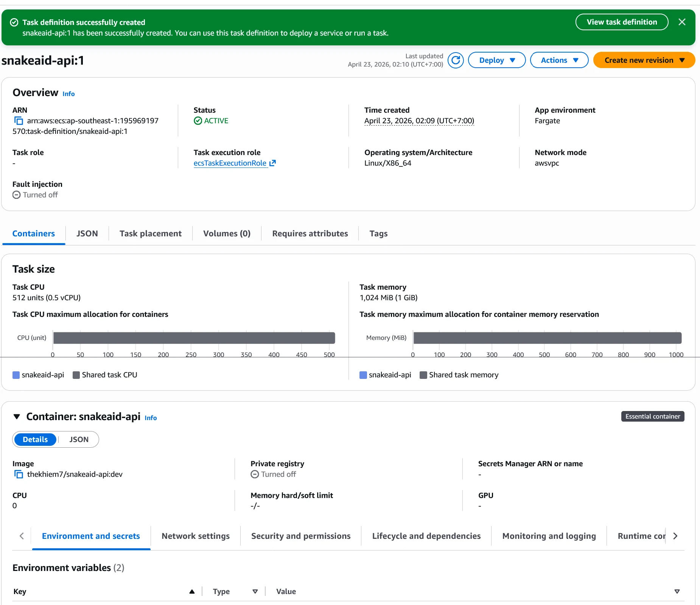

Then confirm that the AI task definition was created separately rather than being merged into the API task.

### Screenshot: snakeai

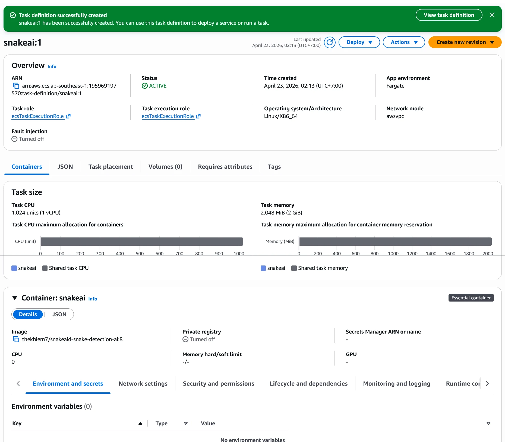

---

## Key Insight

If you have worked with Docker Compose before, the cleanest shortcut is to think of a task definition as the ECS-native version of a single service blueprint.


---

## TL;DR

At minimum, you are really filling five things: name, image, port, env, and sizing.

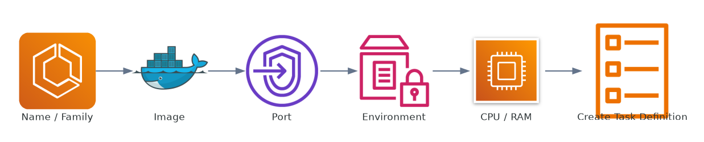

---

## Next Step

When both tasks are ready, continue with **ALB + Service**.

At that point, the task definitions stop being just blueprints and become attachable compute units behind the load balancer and ECS services.

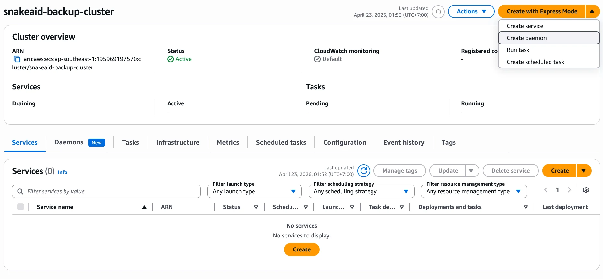
