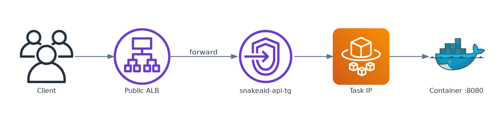
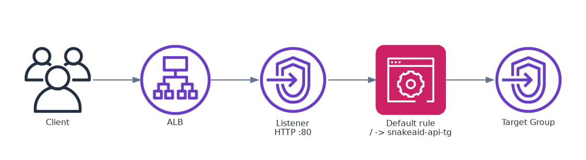
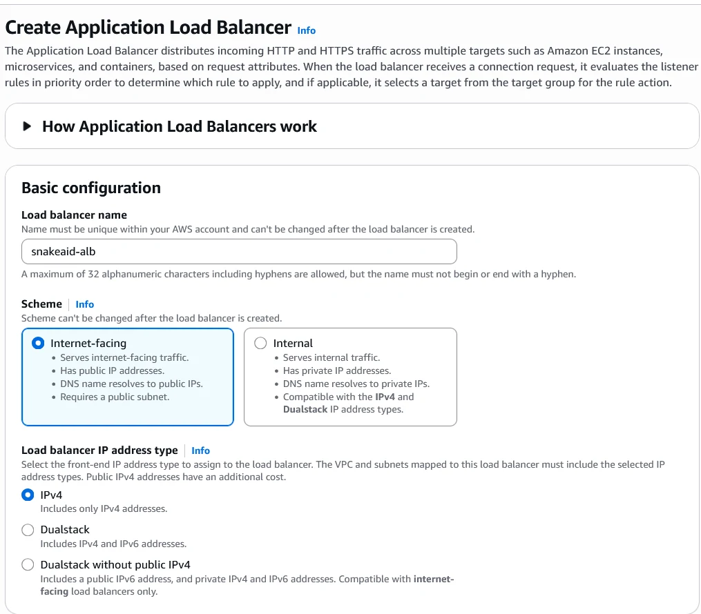
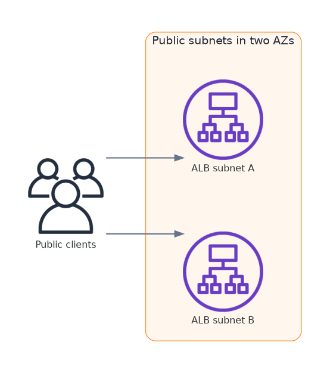
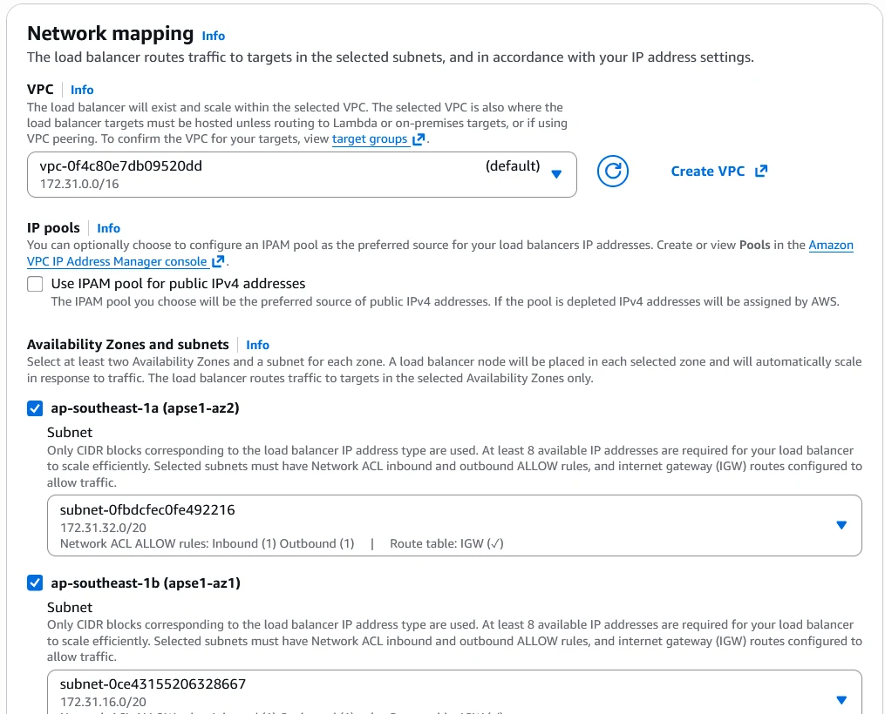
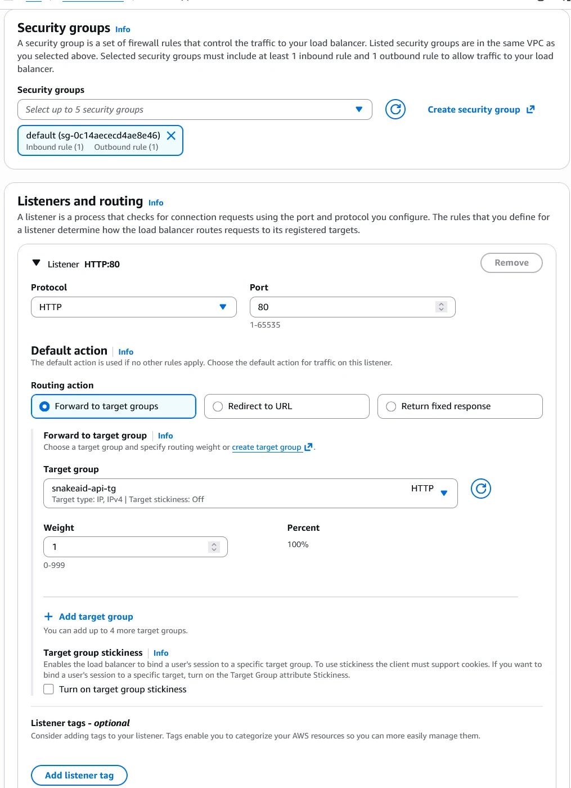
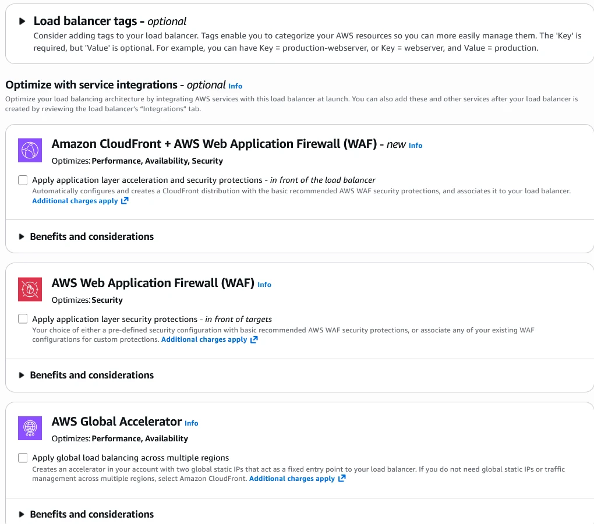
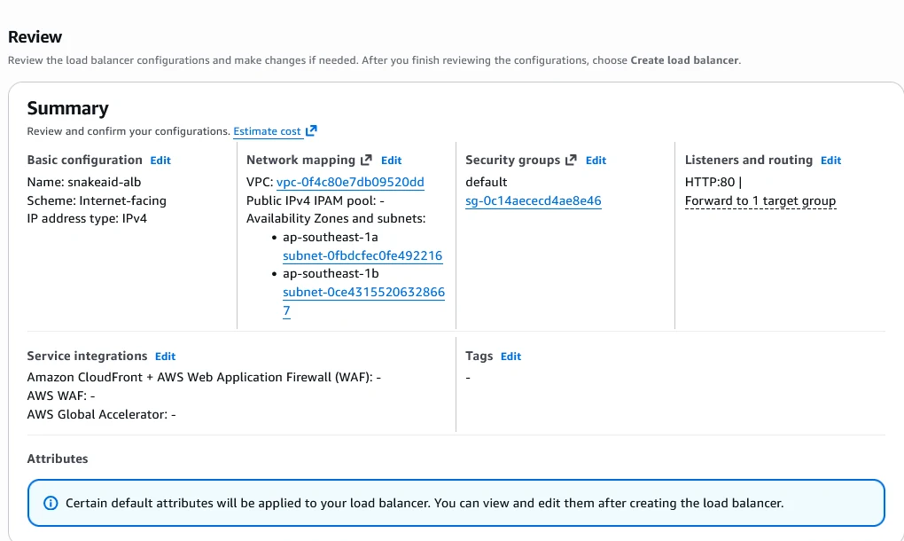
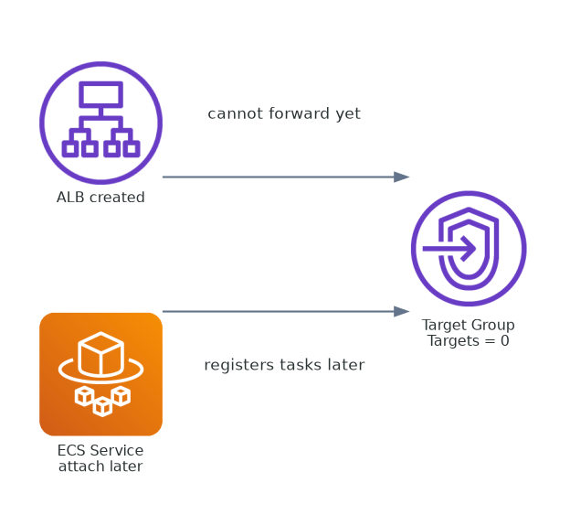

## Goal of This Step

Create an ALB as the public entry point for the ECS backup system.



---

## What Is ALB in This Architecture?

ALB acts as:

* public entry point
* listener/rule-based router
* forwarder to target groups

Important: ALB does not host backends. It only forwards traffic.

### ALB Components



The easiest way to think about ALB is: it accepts public traffic, applies listener rules, and forwards requests into a target group.

---

## A. Basic configuration

Set:

```text
Load balancer name: snakeaid-alb
Scheme: Internet-facing
IP type: IPv4
```

Quick meaning:

* `Internet-facing` = reachable from the public internet
* `Internal` = private inside VPC

For SnakeAid backup use case, choose `Internet-facing`.



---

## B. Network mapping

Choose:

```text
VPC: vpc-xxx
Subnets: ap-southeast-1a, ap-southeast-1b
```

Rules:

* ALB should span >= 2 AZs for availability
* subnets should be public (route to IGW)
* VPC must match ECS service and target group

This is where network placement matters more than ALB settings themselves: the load balancer should live in public subnets, while the backend tasks can still stay elsewhere depending on the final design.





---

## C. Security groups

Current example:

```text
default security group
```

Mandatory check:

```text
Inbound: HTTP 80 from 0.0.0.0/0
```

Without proper inbound rules, ALB can be created but not reachable.



---

## D. Listeners and routing (most important)

Set default listener:

```text
Listener: HTTP :80
Action: Forward -> snakeaid-api-tg
```

This is the real routing layer of the stack: the listener receives traffic, the rule decides where it goes, and the target group becomes the backend pool that ECS will later populate.


---

## E. Advanced services

At this stage, it is fine to skip:

* CloudFront
* WAF
* Global Accelerator



---

## F. Review before create

Minimum checklist:

* Name: `snakeaid-alb`
* Scheme: `Internet-facing`
* Subnets: 2 AZ
* Listener: `HTTP:80`
* Action: forward to `snakeaid-api-tg`

Then click:

```text
Create load balancer
```



---

## Key Insight

If your target group is still empty (Targets = 0), ALB cannot forward real traffic yet.



---

## TL;DR

ALB is the public entry point, the target group is the backend pool, and ECS Service is the layer that eventually supplies real running targets.

---

## Next Step

Move to Target Group step or Create Service to bind containers into ALB.
