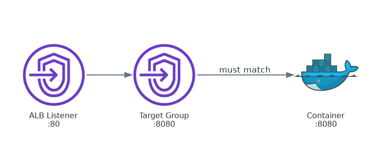
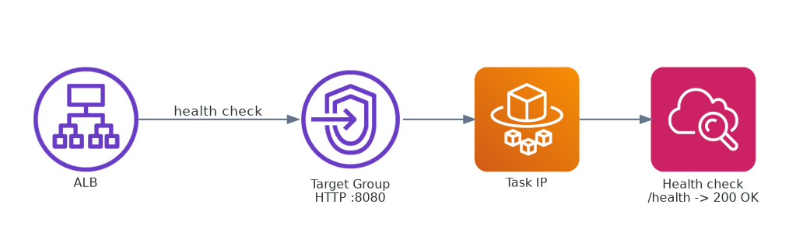
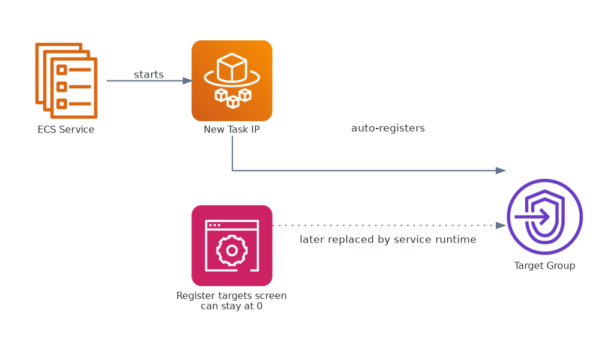
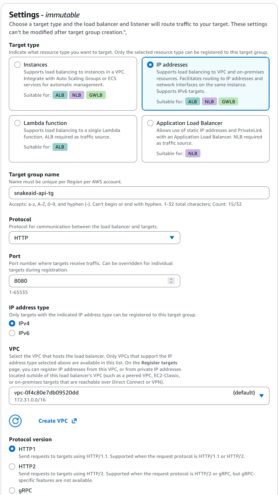
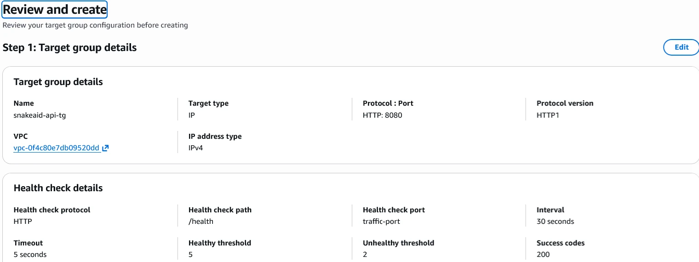
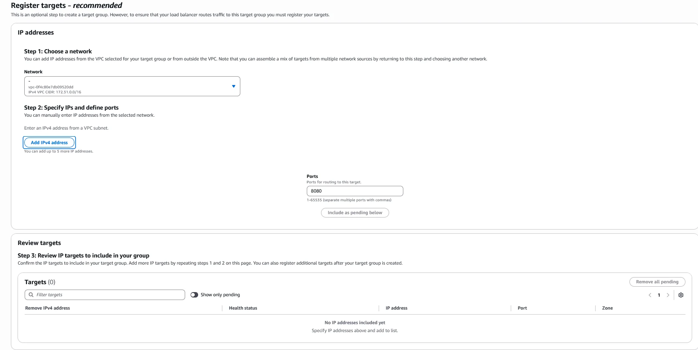
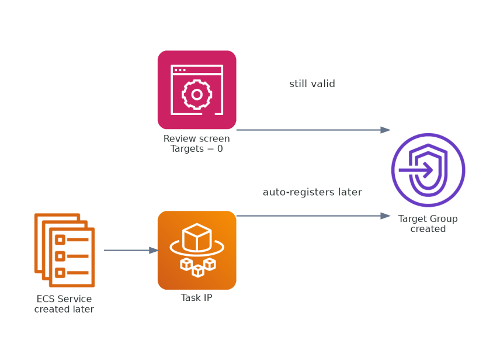
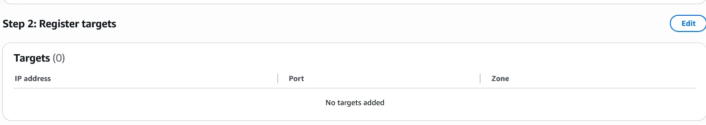

## Mục tiêu bước này

Tạo Target Group để ALB biết cách gọi backend của ECS.



---

## Target Group là gì?

Target Group là phần định nghĩa backend pool để ALB biết request cần được đẩy về đâu.

Nó định nghĩa cách ALB gọi backend: protocol, port, health check.

### Luồng health check



### ECS tự động đăng ký target



### Quan hệ các port


Ba góc nhìn này đi cùng nhau để giải thích trọn vai trò của target group: định nghĩa hợp đồng backend, kiểm tra health, và chờ ECS đăng ký task IP thật về sau.

---

## A. Step 1 - Target group details

### 1. Target type

Chọn:

```text
IP addresses
```

Vì sao:

* `Instances` dùng cho EC2
* `IP addresses` dùng cho ECS Fargate/container
* `Lambda` dùng cho Lambda function

Với SnakeAid chạy ECS Fargate, bắt buộc chọn `IP addresses`.



### 2. Name

```text
snakeaid-api-tg
```

Tên này là label để quản lý, không ảnh hưởng logic runtime.

### 3. Protocol và Port

```text
HTTP : 8080
```

Cực kỳ quan trọng:

```text
Port target group phải khớp container port
```

Nếu container lắng nghe 8080 thì target group cũng phải là 8080.


### 4. VPC

```text
vpc-xxx
```

VPC của target group phải cùng môi trường với ECS service và ALB.

### 5. Protocol version

```text
HTTP1
```

Giữ mặc định là phù hợp cho case hiện tại.

---

## B. Health Check

Set:

```text
Protocol: HTTP
Path: /health
```

ALB sẽ gọi:

```text
http://<task-ip>:8080/health
```

Yêu cầu endpoint trả về `200 OK`.

Nếu sai path hoặc app không có route này, target sẽ bị `UNHEALTHY`.




---

## C. Step 2 - Register targets (điểm hay nhầm)

Ở bước này với ECS Fargate:

```text
KHÔNG cần nhập IP thủ công
```

Giữ trạng thái:

```text
Targets = 0
```

Lý do:

ECS Service sẽ tự động register task IP vào target group khi service chạy.




---

## D. Step 3 - Review và Create

Nếu bạn thấy `Targets (0)` ở màn review thì vẫn đúng cho flow ECS.

Bấm:

```text
Create target group
```





---

## Lỗi phổ biến cần tránh

* Nhập IP thủ công ở bước register target
* Port mismatch giữa target group và container
* Health check path sai hoặc không tồn tại

---

## TL;DR

Target Group định nghĩa cách ALB gọi backend, còn bước register targets có thể để trống vì ECS sẽ nạp target về sau.

---

## Bước tiếp theo

Quay lại ECS Cluster và tạo Service để bind task vào Target Group.
