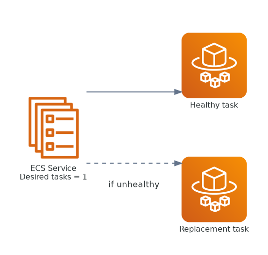
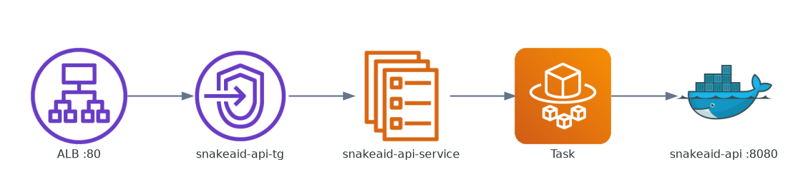
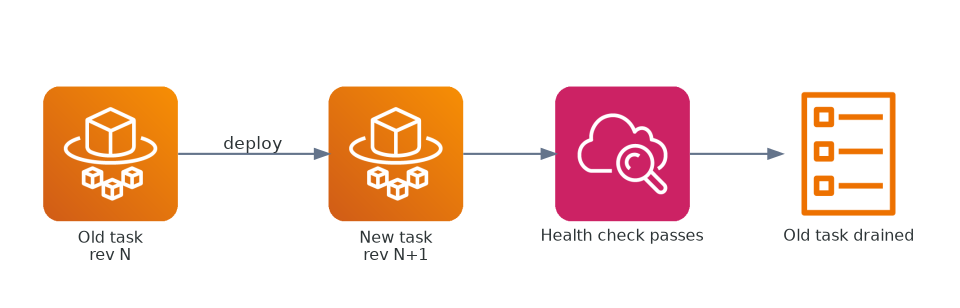
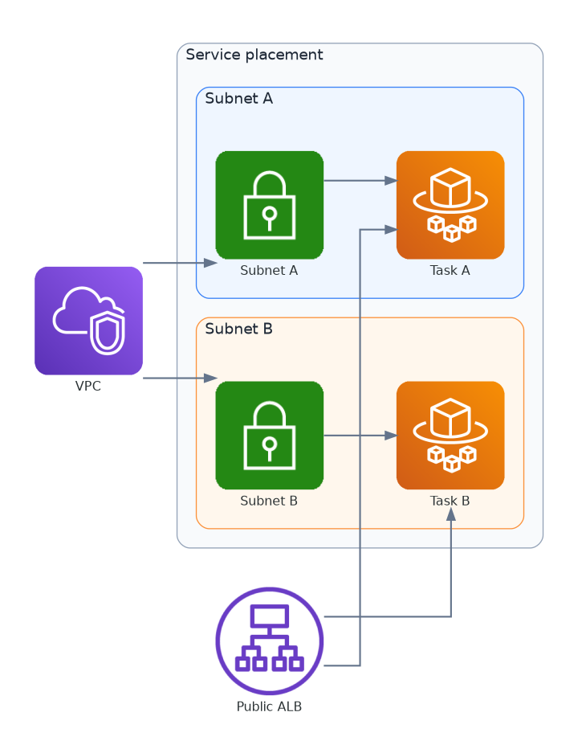
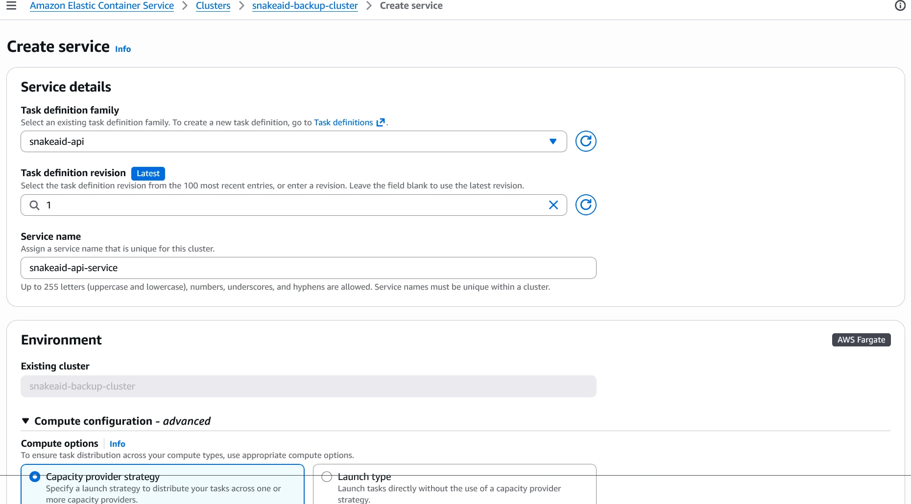
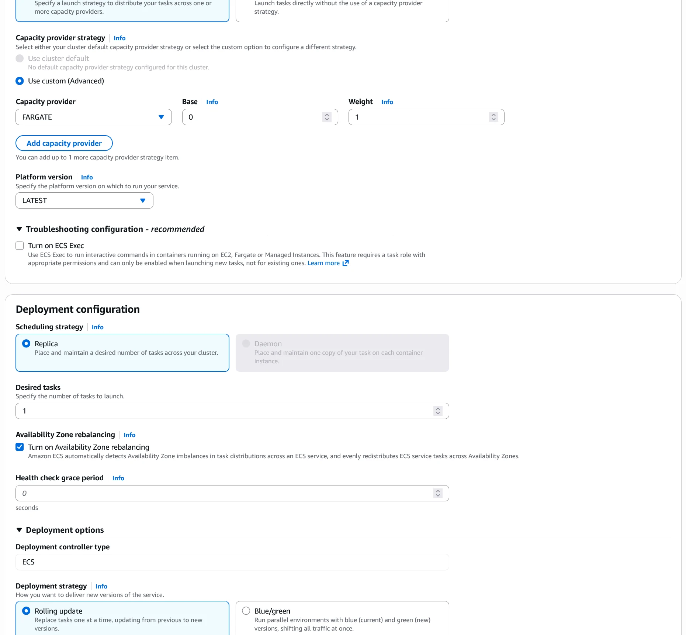
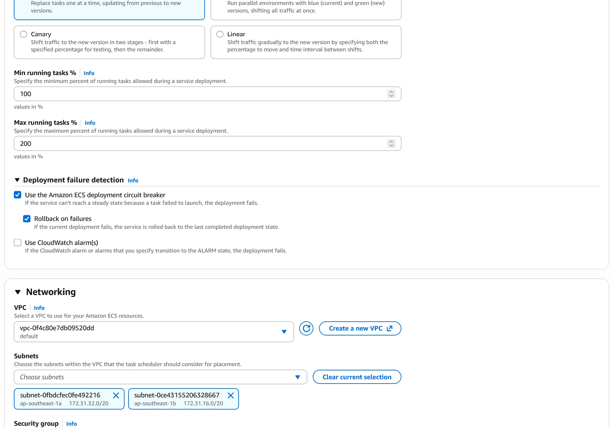
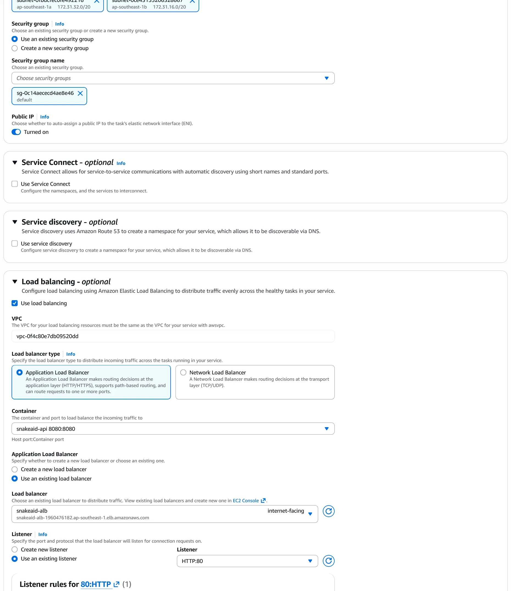

## Goal of This Step

This is the core ECS orchestration step:

```text
Run tasks + attach to ALB + auto-heal + scale
```

---

## Console Entry

Open:

```text
Amazon Elastic Container Service > Clusters > snakeaid-backup-cluster > Services > Create
```


---

## What are you doing on this screen?

```text
ECS Service = orchestration layer
```

It is responsible for:

* running tasks from task definition
* keeping desired replica count
* registering tasks into target group
* integrating with ALB health checks and routing

### Service Orchestration



### ALB Binding



### Rolling Update



### Task Network Placement



---

## Screens by UI Phase

### Phase 1: Service details and environment



### Phase 2: Deployment configuration



### Phase 3: Networking



### Phase 4: Load balancing



---

## 1. Service details

Typical values:

```text
Task definition family: snakeaid-api
Revision: Latest
Service name: snakeaid-api-service
```

Meaning:

* Task definition = container configuration
* Service = runtime controller that keeps tasks alive


---

## 2. Environment

```text
Cluster: snakeaid-backup-cluster
```

Cluster is the runtime environment where services and tasks run.

---

## 3. Compute configuration

```text
Capacity provider strategy: FARGATE
```

This means serverless containers with no EC2 management.

---

## 4. Deployment configuration

```text
Scheduling: Replica
Desired tasks: 1
```

This keeps one task running at all times.

Deployment strategy:

```text
Rolling update
Min: 100%
Max: 200%
```

On new revision, ECS starts new tasks, waits for health checks, then replaces old tasks.


---

## 5. Networking (very important)

Current values:

```text
VPC: default
Subnets: 2 AZ
Security group: default
Public IP: Enabled
```

Practical meaning:

* Fargate task receives public IP (easy for testing)
* for production, prefer private subnets for tasks and keep ALB public


---

## 6. Load balancing (main part)

### Load balancer type

```text
Application Load Balancer
```

### Existing ALB

```text
snakeaid-alb
```

### Listener

```text
HTTP : 80
```

### Listener rule

```text
/ -> forward -> snakeaid-api-tg
```

### Target group

```text
Use existing target group: snakeaid-api-tg
```

### Container mapping

```text
Container: snakeaid-api
Port: 8080
```

End-to-end mapping:

```text
ALB:80 -> Target Group -> Container:8080
```

### Health check

```text
Path: /health
Protocol: HTTP
```

If health checks fail, ECS replaces unhealthy tasks automatically.


---

## 7. Service auto scaling

Can stay disabled at this stage.

```text
Always = 1 instance
```

---

## 8. Volume

For stateless API, you can skip volume configuration.

---

## 9. Tags

No runtime impact. You can fill later.

---

## Architecture after this step

```text
Internet
  -> ALB (snakeaid-alb)
  -> Listener :80
  -> Rule "/"
  -> Target Group (snakeaid-api-tg)
  -> ECS Service
  -> Fargate Task
  -> Container (8080)
```

---

## Pre-create checklist

1. Task definition exposes port `8080`
2. `/health` endpoint returns `200`
3. Security group allows required traffic
4. After deploy, validate with `http://<alb-dns>`

---

## TL;DR

```text
Use existing ALB + existing Target Group + correct container port
=> ECS Service binds traffic correctly
```

---

## Next Step

When service is `Healthy`, run end-to-end ALB DNS test and continue with `snakeai` service configuration.
