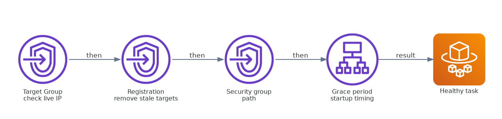
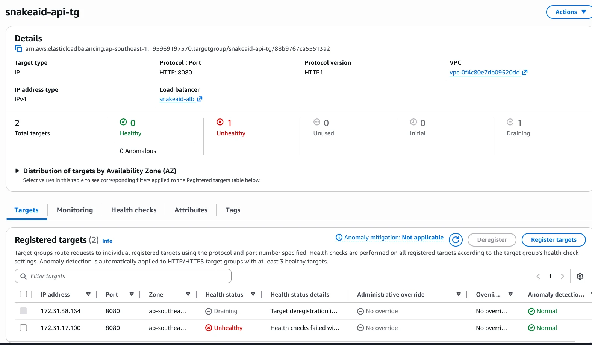
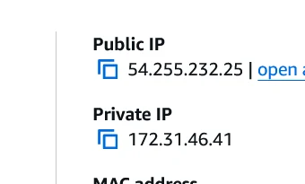
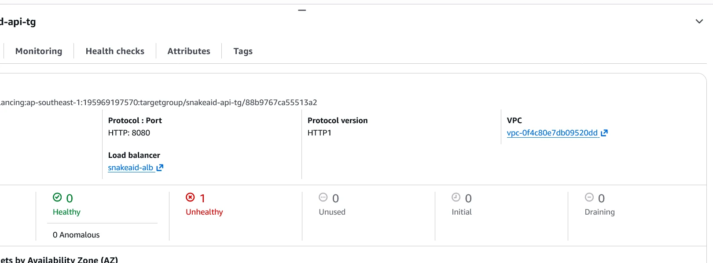
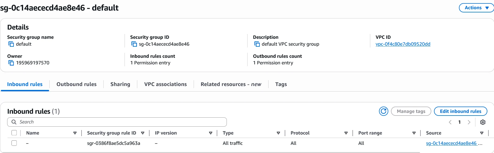
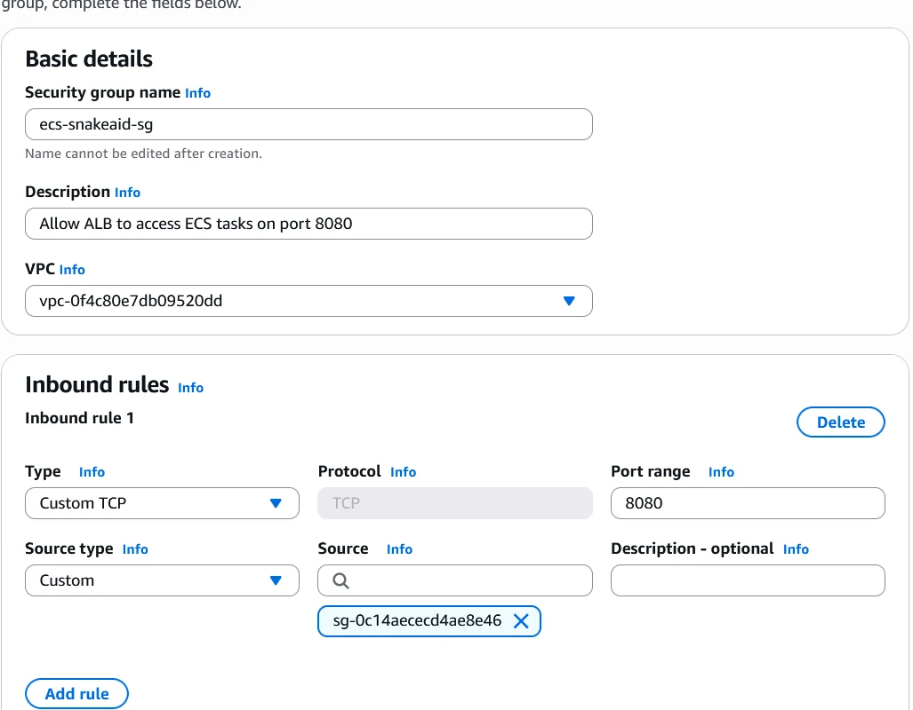
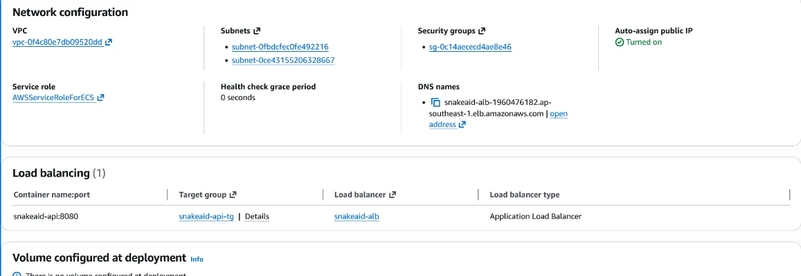
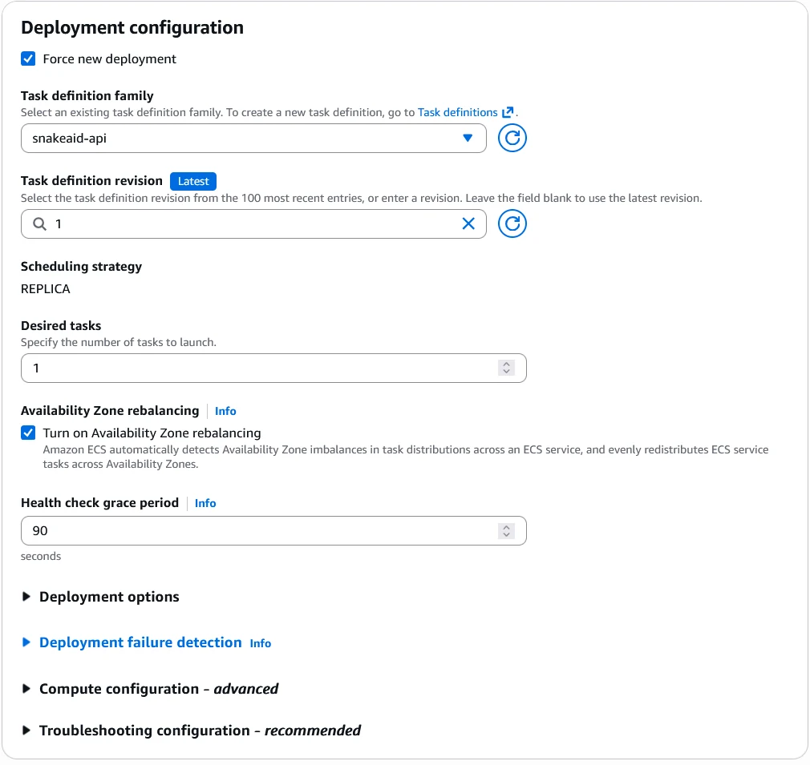
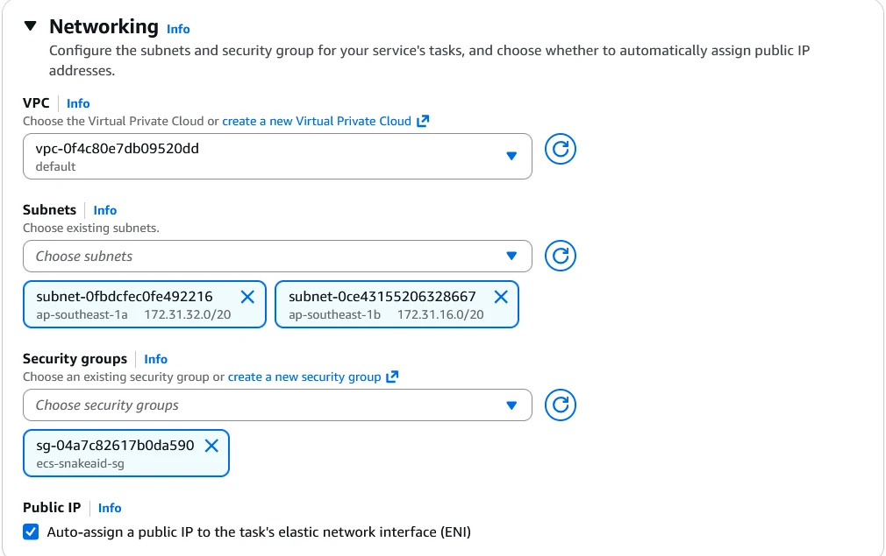

# Khắc phục mục tiêu không khỏe mạnh trong nhóm mục tiêu ECS

Trong quá trình thiết lập thành phần sao lưu đám mây của kiến trúc hybrid chống thảm họa SnakeAid, chúng tôi gặp phải một vấn đề phổ biến khi tích hợp AWS ECS và Application Load Balancer (ALB): các mục tiêu không khỏe mạnh trong nhóm mục tiêu. Bài viết này ghi lại quy trình khắc phục từng bước mà chúng tôi đã thực hiện để giải quyết vấn đề.

Điều quan trọng nhất của ca xử lý này không nằm ở một screenshot riêng lẻ, mà ở thứ tự điều tra: xác nhận task IP đang chạy, gỡ target cũ, kiểm tra security-group path, rồi mới xử lý startup timing qua grace period.

## Vấn đề ban đầu

Sau khi triển khai dịch vụ snakeaid-api lên ECS Fargate, các kiểm tra sức khỏe ALB thất bại, đánh dấu các mục tiêu là không khỏe mạnh. Điều này ngăn cản lưu lượng truy cập đến ứng dụng, gây ra lỗi 502.

Điều hướng: `EC2 > Target groups > snakeaid-api-tg`

## Bước 1: Đối chiếu target group với ECS task đang chạy

Trước tiên, chúng tôi xác nhận vấn đề không nằm ở mã nguồn ứng dụng. Container đã expose cổng `8080`, ứng dụng ASP.NET Core lắng nghe trên `0.0.0.0:8080`, và endpoint `/health` có sẵn. Bước tiếp theo là kiểm tra xem target group có đang trỏ đúng vào ECS task hiện tại hay chưa.

Điều hướng: `ECS > Clusters > snakeaid-backup-cluster > Services > snakeaid-api-service > Tasks > <running-task> > Configuration`

ECS task đang chạy có private IP `172.31.46.41`, trong khi target group vẫn giữ các IP cũ từ các lần chạy trước. Sự lệch này cho thấy lỗi đầu tiên là target group đang chứa target đã lỗi thời.

## Bước 2: Gỡ target cũ rồi kiểm tra lại health check

Chúng tôi hủy đăng ký các target cũ và để ECS service tự động đăng ký lại private IP của task đang chạy. Sau khi dọn sạch target cũ, target group không còn IP stale nữa, nhưng health check vẫn tiếp tục thất bại.

Điều hướng: `EC2 > Target groups > snakeaid-api-tg`

Cách này cho thấy vấn đề còn lại không còn là đăng ký target nữa. Lúc này cần kiểm tra tiếp đường đi mạng và thời gian khởi động của ứng dụng.

## Bước 3: Kiểm tra security group hiện tại của task

ECS service lúc này vẫn gắn với security group mặc định của VPC. Inbound rule của nó chỉ cho phép lưu lượng từ chính security group đó, vừa khó đọc vừa dễ cấu hình sai cho đường đi ALB tới ECS task.

Điều hướng: `EC2 > Security groups > sg-0c14aececd4ae8e46`

## Bước 4: Tạo security group riêng cho ECS task

Để đường đi mạng rõ ràng hơn, chúng tôi tạo một security group riêng cho ECS task. Rule inbound duy nhất cho phép TCP `8080` từ security group của ALB, còn outbound vẫn để mở cho các phụ thuộc như Supabase, Firebase, Doppler và RabbitMQ.

Điều hướng: `EC2 > Security groups > Create security group`

## Bước 5: Sửa health check grace period

Trong cấu hình service, chúng tôi cũng phát hiện health check grace period vẫn đang là `0 seconds`. Điều đó có nghĩa là load balancer bắt đầu gọi `/health` ngay sau khi task khởi động, trước khi ứng dụng kịp hoàn tất quá trình warm-up.

Điều hướng: `ECS > Clusters > snakeaid-backup-cluster > Services > snakeaid-api-service > Configuration and networking`

## Bước 6: Cập nhật ECS service và ép triển khai mới

Chúng tôi mở `Update service`, bật `Force new deployment`, tăng grace period lên `90 seconds`, đồng thời thay default security group bằng `ecs-snakeaid-sg`.

Điều hướng: `ECS > Clusters > snakeaid-backup-cluster > Services > snakeaid-api-service > Update service`

## Xác minh

Sau các thay đổi này, hành vi của service đã khớp với luồng ECS + ALB mong đợi:

- Target group chỉ còn đăng ký private IP của ECS task đang chạy.
- ALB có thể truy cập task qua cổng `8080`.
- Health check có đủ thời gian chờ để ứng dụng hoàn tất khởi tạo.
- Target chuyển từ `Unhealthy` sang `Healthy`.

## Bài học rút ra

- Không nên đăng ký thủ công target trong target group kiểu IP khi target group đó do ECS service quản lý.
- Nên tách riêng security group cho ALB và cho ECS task để hợp đồng mạng rõ ràng, dễ debug.
- Cần rà soát health check grace period khi ứng dụng có bước khởi tạo phụ thuộc vào dịch vụ bên ngoài.
- Khi target unhealthy, nên kiểm tra theo thứ tự: private IP của task, target group registration, đường đi qua security group, rồi mới đến grace period.

Việc khắc phục sự cố này củng cố hiểu biết của chúng tôi về mạng AWS trong các triển khai ECS, rất quan trọng để duy trì độ tin cậy của kiến trúc hybrid SnakeAid.
