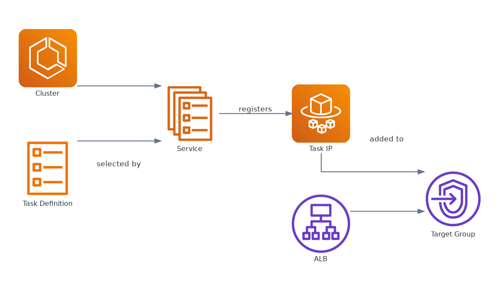

## Mục tiêu trang

Phần này ghi lại workflow thao tác thủ công trên AWS Console cho hướng triển khai **ECS Fargate Classic** của SnakeAid.

---

## Phạm vi

* Dùng cho các thao tác cấu hình thủ công trên AWS Console cho ECS Fargate Classic
* Bám theo luồng triển khai chi tiết hiện tại của dự án
* Mỗi mục con sẽ là một tác vụ cụ thể

---

## Mental model cho quá trình triển khai trên AWS

Trước khi đi vào từng thao tác trên Console, nên giữ sẵn ba góc nhìn: thứ tự triển khai, hình dạng runtime, và quan hệ phụ thuộc giữa resource.

### Bản đồ luồng thao tác trên Console

Đây là thứ tự thao tác thường dùng trên AWS Console. Nó trả lời câu hỏi: "Nên tạo cái gì trước để các resource phía sau attach đúng và ít lỗi hơn?"

### Mental model runtime

Phần này chuyển từ thứ tự setup sang hành vi lúc hệ thống chạy thật. Nó cho thấy traffic đi vào backup stack như thế nào sau khi hạ tầng đã được tạo xong.

### Quan hệ phụ thuộc giữa các resource

Góc nhìn này hữu ích nhất khi có lỗi. Nó giúp lần ngược xem resource nào đang phụ thuộc resource nào, đặc biệt quanh ALB, target group, service, và health check.

Ba diagram này đi cùng nhau để giảm một nhầm lẫn rất hay gặp: luồng bấm trên Console không hoàn toàn trùng với luồng runtime, và cũng không trùng hẳn với dependency graph.

---

## Điều kiện trước khi thao tác

* Có tài khoản AWS và quyền truy cập phù hợp
* Chọn đúng region cho môi trường triển khai
* Chuẩn bị sẵn các thông tin đầu vào (service name, port, image, env)

---

## Series này sẽ đi qua những gì

Chuỗi bài này được sắp theo luồng setup Fargate cốt lõi của SnakeAid:

1. Tạo ECS cluster
2. Khai báo các task của ứng dụng
3. Tạo ALB và target group
4. Tạo ECS service và gắn traffic
5. Kiểm tra health check và failover behavior

Các chủ đề bổ sung như kết nối Amazon MQ và troubleshooting sẽ được chèn vào đúng chỗ khi chúng thật sự liên quan tới vận hành.

Vì vậy, các page bên dưới nên được đọc như một deployment path liên tục hơn là các tutorial tách rời.

---

## Các mục con

{}

---

## Gợi ý cách đọc

Nếu bạn đang đi setup lần đầu, hãy đọc theo đúng thứ tự trên sidebar. Mỗi page đều giả định resource của page trước đã tồn tại.
