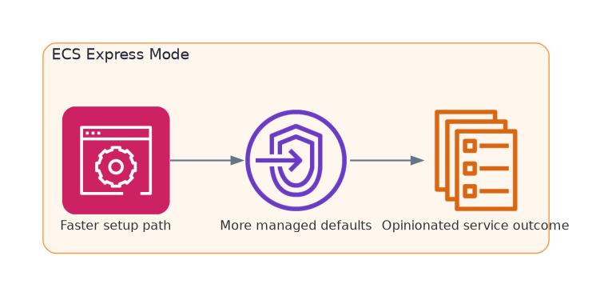

## Page Objective

This section will document the AWS Console workflow for **ECS Express Mode** as a faster and more opinionated deployment path.

---

## Scope

* Focuses on the simplified deployment experience of ECS Express
* Keeps the content separate from the Fargate Classic workflow
* Will be used for side-by-side comparison with the manual Fargate path

---

## Planned Child Topics

The focus here is not to reproduce the Fargate Classic flow with fewer screenshots. It is to understand what ECS Express chooses for you, what it hides, and where that changes the operational trade-off.

1. Create an ECS Express service
2. Review generated networking and endpoint resources
3. Validate logs, health, and rollback behavior
4. Compare Express output with the Fargate Classic stack

---

## Current Status

This section is still early, but it already serves a clear role: it is the place where Express Mode will be documented as its own deployment path rather than as a footnote to Fargate Classic.

---

## Child Pages

{}
