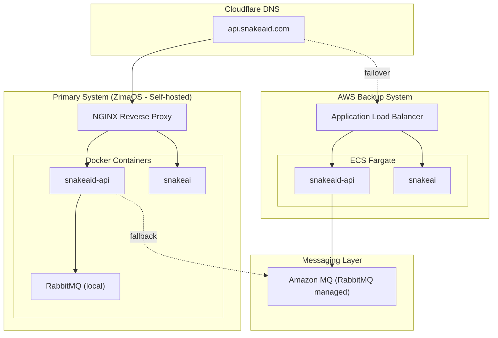

# SnakeAid Disaster-Aware 
# Hybrid Architecture

## Objectives

Build a **hybrid architecture (self-host + cloud backup)** to:

* Ensure **service availability** when self-hosted infrastructure fails (power outage, network outage)
* Reduce full dependence on cloud (cost + control)
* Keep the system **lean and easy to operate (low ops overhead)**
* Allow gradual scaling to production-grade when needed

---

## Architecture Overview



---

## System Components

### Edge Layer

* **Cloudflare DNS**

	* Primary domain: `api.snakeaid.com`
	* Routing:

		* Primary -> ZimaOS
		* Failover -> AWS ALB (manual now, automated in the future)

---

### Primary System (ZimaOS)

The current self-hosted system is the **main runtime**:

* **NGINX Reverse Proxy**

	* Port/subdomain-based routing
* **snakeaid-api (monolithic backend)**
* **snakeai (AI inference service)**
* **RabbitMQ (local container)**

Benefits:

* Low latency
* Full control
* No cloud runtime cost

---

### Backup System (AWS ECS)

The cloud system serves as **standby (active-passive)**.

#### Compute:

* **ECS Fargate**

	* Service 1: `snakeaid-api`
	* Service 2: `snakeai`
	* Per service: 1 instance

#### Networking:

* **Application Load Balancer (ALB)**

	* Provides a stable endpoint
	* Health checks
	* Routing

#### Registry:

* Docker Hub (reduced ops overhead)

---

### Messaging Layer (Dual RabbitMQ)

The system uses **two queue sources in parallel**:

#### Local RabbitMQ

* Runs on ZimaOS
* Serves primary workload

#### Amazon MQ (RabbitMQ managed)

* Serves backup system (ECS)
* Acts as fallback queue

---

## Disaster Awareness Strategy

### Active-Passive Failover

| State       | Routing                  |
| ----------- | ------------------------ |
| Normal      | Cloudflare -> ZimaOS     |
| ZimaOS down | Cloudflare -> ALB -> ECS |

---

### Dual Queue Strategy

#### Primary (ZimaOS):

```text
Priority: local RabbitMQ
Fallback: Amazon MQ
```

#### Backup (ECS):

```text
Use only: Amazon MQ
```

---

### Queue Behavior

* There is no replication between the two queues
* During failover:

	* Pending local messages may be lost
* The system accepts:

	* **eventual consistency**
	* **best-effort delivery**

---

## Trade-offs and Assumptions

### Queue Non-Synchronization

* Local RabbitMQ != Amazon MQ
* Full message retention is not guaranteed

---

### Idempotency Requirement

The backend must ensure:

* Safe retry handling
* No duplicate side effects

---

### Cold/Warm Standby

* Cold standby:

	* ECS scale = 0 -> cost saving
	* Includes cold start time
* Warm standby:

	* ECS always running -> faster failover

---

### Not Full High Availability Yet

* No multi-region deployment
* No fully automated failover (at current stage)

---

## Architecture Advantages

* Reduced cloud dependence (cost + control)
* Practical disaster recovery path
* Preserves existing system (zero rewrite)
* Simple operations (no Kubernetes, no over-engineering)
* Clear scaling roadmap

---

## Future Roadmap

### Phase 1 (current)

* Active-passive
* Manual failover
* Dual RabbitMQ

---

### Phase 2

* Cloudflare Load Balancer (auto failover)
* ECS auto scaling

---

### Phase 3

* Message replication (Outbox / Event sourcing)
* Multi-region deployment

---

### Phase 4

* AI scaling (GPU / SageMaker)
* Event-driven architecture (Kafka if needed)

---

## Conclusion

The proposed architecture is a:

> **Disaster-aware Hybrid Architecture (Self-host + Cloud Backup)**

It balances:

* **Reliability** (cloud backup available)
* **Cost-efficiency** (self-hosted primary)
* **Operational simplicity** (no over-engineering)

It is suitable for:

* Startup stage
* Capstone project
* Medium-scale production systems

---

## One-line Summary

```text
Cloudflare DNS -> (Primary: ZimaOS + local RabbitMQ)
							 -> (Backup: ALB -> ECS Fargate + Amazon MQ)
```