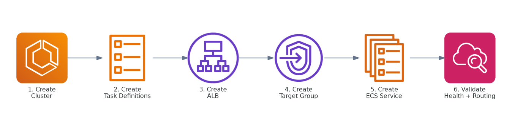
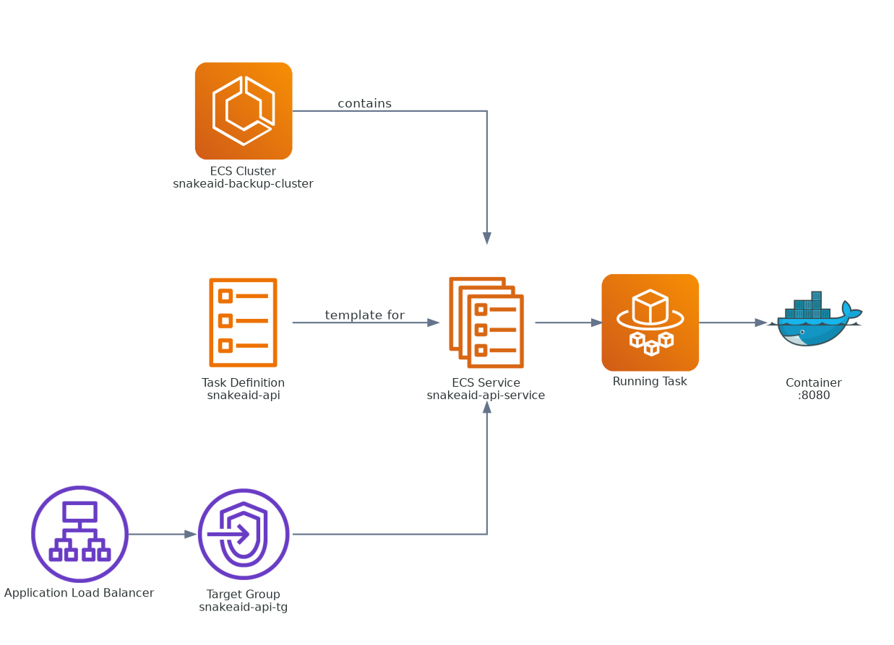

## Page Objective

This page is a standard scaffold for documenting AWS Console procedures used in the SnakeAid architecture.

---

## Scope

* Covers manual configuration workflows in AWS Console
* Follows the actual deployment flow of this project
* Each child page represents one specific operational task

---

## AWS Backup Mental Model

### Console Workflow Map

### Runtime Mental Model

### Resource Dependency

---

## Prerequisites

* AWS account with appropriate permissions
* Correct deployment region selected
* Required inputs prepared (service name, port, image, env)

---

## Child Page Template

Each child page should follow this structure:

1. **Purpose**
2. **Required inputs**
3. **Console steps**
4. **Expected result**
5. **Notes / common issues**
6. **Rollback (if applicable)**

---

## Planned Child Topics

1. Create ECS Cluster (Fargate)
2. Create Task Definition for `snakeaid-api`
3. Create Task Definition for `snakeai`
4. Create ALB and Target Groups
5. Create ECS Services and attach ALB
6. Configure Amazon MQ connectivity
7. Validate health checks and failover

---

## Child Pages

{}

---

## Authoring Notes

* Include Console navigation paths for each step
* Keep naming conventions consistent across resources
* If screenshots are used, store them in `static/images/` and reference with root-relative paths

---

## Upcoming Content

Detailed procedures will be added incrementally as child pages under this section.
