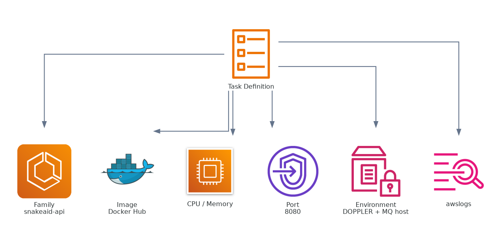
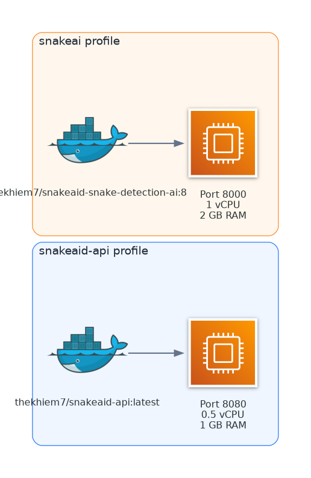

## Goal of This Step

Create two separate task definitions for SnakeAid:

1. `snakeaid-api`
2. `snakeai`

---

## What Is a Task Definition?

In Amazon Elastic Container Service:

> **Task Definition = the container blueprint**

Equivalent mental model:

```text
docker-compose (single service) ≈ Task Definition
```

It defines:

* image
* port
* env
* CPU / RAM

### Task Definition Anatomy



### Task Definition to Runtime Mapping


### API vs AI Task Profiles



### IAM Roles in Task Execution


---

## Prerequisite Check

Before creating task definitions, confirm the backup cluster from Step 1 was created successfully.


---

## Screenshot Reference Convention

In Hugo markdown, use only root-relative public paths:

* `/images/aws-console-operations-guide/ECS/1.%20create-cluster/ecs-clusters-created.png`
* `/images/aws-console-operations-guide/ECS/2.%20create-task-definition/task-definition.png`
* `/images/aws-console-operations-guide/ECS/2.%20create-task-definition/task-definition-create.png`
* `/images/aws-console-operations-guide/ECS/3.%20task-definition-results/task-snakeaid-api-rev1.png`
* `/images/aws-console-operations-guide/ECS/3.%20task-definition-results/task-snakeai.png`
* `/images/aws-console-operations-guide/ECS/2.%20create-task-definition/ecs-services.png`

Do not use filesystem paths like `static/images/...` inside page content.

---

## A. Navigate to Task Definitions

1. In the top search bar, type:

```text
Task definitions
```

2. Click:

```text
Task definitions
```

3. On the task list screen, click:

```text
Create new task definition
```

Either button works (middle or top-right).


---

## B. Step 2A - Create Task Definition for API

You are now at the core ECS screen. It is long, so focus only on the required fields to avoid overload.

### Current objective

```text
Task Definition for snakeaid-api
```

You only need about 20% of the fields to make it run.


### 1. Task definition configuration

Meaning: general information for the container blueprint.

```text
Task definition family: snakeaid-api
```

### 2. Infrastructure requirements

Meaning: choose how containers will run (serverless vs managed servers).

```text
Launch type: AWS Fargate
```

### 3. Task size (important)

Meaning: CPU and RAM allocated to the container.

```text
CPU: 0.5 vCPU
Memory: 1 GB
```

This is sufficient for the current backend workload.

### 4. Container (most important section)

This section is equivalent to `docker run config`.

```text
Name: snakeaid-api
Image URI: thekhiem7/snakeaid-api:latest
```

Using Docker Hub here is fine for this stage.

### 5. Port mappings

ECS must know which port your app listens on.

```text
Container port: 8080
Protocol: TCP
```

### 6. Environment variables (very important)

This replaces env configuration from docker-compose.

```text
DOPPLER_TOKEN=your_token
DOPPLER_CONFIG=snake-aid/dev
RabbitMq__Host=<Amazon MQ endpoint>
```

Critical note:

```text
Do NOT use: rabbitmq
```

ECS does not include your local RabbitMQ container from self-host mode.

### 7. Logging

Logs will be sent to CloudWatch.

```text
Log driver: awslogs
Region: ap-southeast-1
Log group: auto create
```

### 8. Task role and Execution role

These are required IAM roles for the task.

```text
Create new role
```

For both roles:

* Task role
* Execution role

### 9. Fields to skip

No need to touch these at this step:

* GPU
* Storage
* Firelens
* Volumes
* Health check (set later)
* Container dependency

### 10. Create task

```text
Create
```

Expected result:

```text
Task Definition: snakeaid-api (rev 1)
```

---

## C. Step 2B - Repeat for snakeai

Use the same flow for the AI service with this quick config:

```text
Name: snakeai
Image: thekhiem7/snakeaid-snake-detection-ai:8
Port: 8000
CPU: 1 vCPU
Memory: 2 GB
```

After both tasks are created (API + AI), share screenshots and continue to ALB + Service.

---

## D. Confirm Results

After completion, the task list should include:

* `snakeaid-api` (rev 1)
* `snakeai`

### Screenshot: snakeaid-api


### Screenshot: snakeai


---

## Key Insight

```text
docker-compose -> ECS task definition
```

---

## TL;DR

```text
Fill: Name + Image + Port + Env + CPU/RAM
-> Create
```

---

## Next Step

When both tasks are ready, continue with **ALB + Service**.


